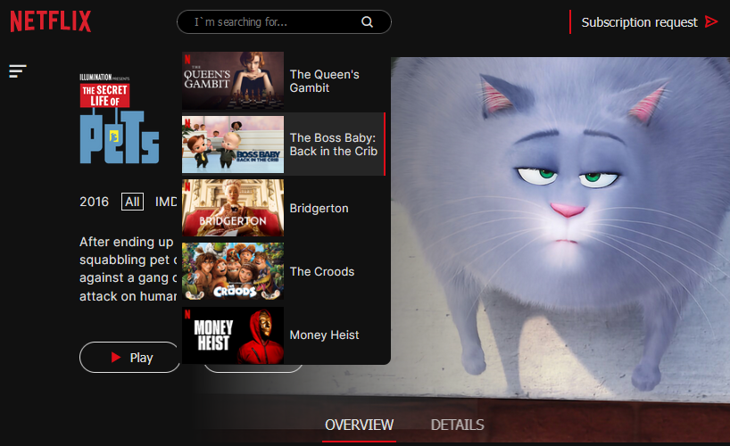

<h1 align="center">Netflix</h1>
<h2 align="center">

</h2>

<h3 align="center">
    <a href="https://netflix-redesignnn.netlify.app/" target="_blank">Life Demo</a>
</h3>

### Description
___
Updated Netflix is a test updated version of the well-known site. I took the basic design from <a href="https://www.behance.net/gallery/93925195/NETFLIX-REDESIGN-UXUI-Movies-TV-Series">here</a>.
This a desktop version of the site, designed for devices with a width of 992px or more     

The project was created using React and SCSS. 

### How it works
__

This is a one-page site, and React Router is used to navigate between such components as 
- Popular (all movies and cartoons)
- Films
- Cartoons
- My list (what was added to My List using LocalStorage)
- All (all movies of each category)
- Form (subscription request)
- NotFoundPage (if the URL is invalid)

**Here are examples of components:**

*Popular:*
 
 

*Form:*

*Cartoons:*

Also, for each movie there is a *trailer*, *review*, *episodes* (if it is a series), *details*, and below a list of movies of a similar category.

At the Header of each component there is a movie *search field*

### Additionally
___

I've learned myself web development without any courses or training, so if you have any comments, I will be happy to chat with you on social networks (see  my <a href="https://github.com/liyakot">profile</a> :fire:)

### Getting Started  
___

### Create React App
This project was bootstrapped with [Create React App](https://github.com/facebook/create-react-app).

#### Available Scripts

In the project directory, you can run:

#### `npm start`

Runs the app in the development mode.\
Open [http://localhost:3000](http://localhost:3000) to view it in your browser.

The page will reload when you make changes.\
You may also see any lint errors in the console.

#### `npm test`

Launches the test runner in the interactive watch mode.\
See the section about [running tests](https://facebook.github.io/create-react-app/docs/running-tests) for more information.

#### `npm run build`

Builds the app for production to the `build` folder.\
It correctly bundles React in production mode and optimizes the build for the best performance.

The build is minified and the filenames include the hashes.\
Your app is ready to be deployed!

See the section about [deployment](https://facebook.github.io/create-react-app/docs/deployment) for more information.

### Learn More

You can learn more in the [Create React App documentation](https://facebook.github.io/create-react-app/docs/getting-started).

To learn React, check out the [React documentation](https://reactjs.org/).

### Icons
I installed icons :
#### `npm i boxicons`

And used them as a font:
##### `<link href="https://unpkg.com/boxicons@2.1.4/css/boxicons.min.css" rel="stylesheet" />`

